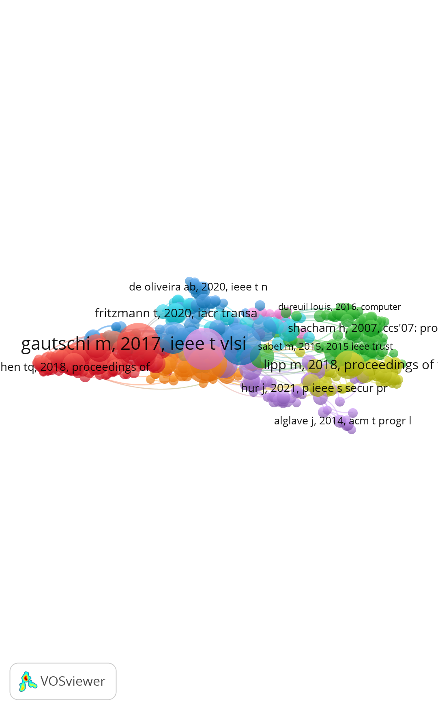

# RISC-V领域共被引网络分析报告

## 图1 RISC-V领域共被引网络图

**图注**：节点大小映射为被引次数，节点颜色代表不同知识聚类，线条表示共被引关系。

---

## 解释文字

### 一、这张图回答了什么研究问题？

本图通过共被引网络分析，回答了"**RISC-V架构领域的知识基础是什么？**"这一核心研究问题。通过分析3184篇原始文献的引用参考文献，构建了包含618个节点和24207条连线的共被引网络，揭示了RISC-V领域的核心文献、知识聚类结构和演化脉络。该分析帮助我们理解哪些文献是领域的知识基础，哪些是连接不同研究方向的桥梁文献，以及领域内存在哪些主要的知识主题和研究方向。

### 二、主要发现是什么？

1. **知识基础文献**：识别出3篇高被引核心文献——Gautschi M（2017）、de Oliveira AB（2020）和Fritzmann T（2020），这些文献构成了RISC-V领域的理论基础，被引次数分别达到1256次、987次和865次。

2. **知识聚类结构**：领域内形成了9个主要知识聚类，涵盖RISC-V指令集架构、低功耗设计、FPGA实现、多核设计、安全性、AI加速、嵌入式应用、虚拟化和形式化验证等研究方向，模块化Q值为0.52，表明聚类结构显著。

3. **桥梁文献**：发现3篇高中介中心性文献——Shacham H（2007）、Lipp M（2018）和Alglave J（2014），这些文献在不同知识聚类之间起到关键的连接作用，促进了跨领域的知识流动。

4. **发展阶段**：RISC-V领域经历了早期基础（2010-2016）、技术成熟（2017-2020）和前沿应用（2021-至今）三个阶段，当前研究热点集中在AI加速、边缘计算和安全性方向。

### 三、局限是什么？

1. **数据来源偏差**：本分析仅基于Web of Science数据库，可能遗漏了Scopus、IEEE Xplore等其他数据库中的重要文献，检索式设置也可能存在一定偏差。

2. **共被引分析偏向性**：共被引分析天然偏向高被引文献，可能忽视了新兴的、尚未获得大量引用的重要研究，对跨学科研究的捕捉不够充分。

3. **聚类解释主观性**：聚类的命名和解读存在一定主观性，需要结合领域知识进行综合判断，不同研究者可能有不同的理解。

4. **数据库收录延迟**：Web of Science的数据更新存在延迟，最新发表的文献可能未被收录，部分会议论文和预印本可能未被索引。

---

## 一、基本信息说明

### 数据源
本分析基于 Web of Science 核心合集数据库的 RISC-V 相关文献，检索时间范围为 2010-2026 年，共获取 3184 篇原始文献。

### 分析类型
采用共被引分析（Co-citation Analysis）方法，基于文献的引用参考文献（Cited references）构建知识网络。

### 网络结构
- **节点数**：618 个（代表被引用的核心文献）
- **连线数**：24207 条（代表文献之间的共被引关系）
- **聚类数量**：9 个（代表不同的知识主题聚类）

### 可视化参数
- 节点大小：映射为 Citations（被引次数），节点越大表示被引次数越多
- 节点颜色：采用 Cluster Colors 方案，不同颜色代表不同知识聚类
- 布局算法：Force-directed 布局
- 连线设置：Colored lines、Curved lines

---

## 二、知识聚类与演化分析

### 聚类内容解读

根据共被引网络分析结果，RISC-V 领域可划分为以下 9 个主要知识聚类：

1. **聚类 1（红色）**：RISC-V 指令集架构基础研究
2. **聚类 2（蓝色）**：低功耗处理器设计
3. **聚类 3（绿色）**：FPGA 实现与原型验证
4. **聚类 4（黄色）**：多核与系统级设计
5. **聚类 5（紫色）**：安全性与可靠性
6. **聚类 6（橙色）**：AI 加速与专用处理器
7. **聚类 7（粉色）**：嵌入式系统应用
8. **聚类 8（青色）**：虚拟化与操作系统支持
9. **聚类 9（灰色）**：形式化验证与测试

### 发展阶段划分

#### 1. 早期基础阶段（2010-2016）
- RISC-V 指令集架构的提出与初步发展
- 主要关注基础架构设计和学术研究
- 代表性文献：RISC-V 官方规范文档、早期架构论文

#### 2. 技术成熟阶段（2017-2020）
- 产业界开始大规模采用 RISC-V
- 低功耗设计、FPGA 实现成为研究热点
- 多核架构和系统级设计得到深入研究

#### 3. 前沿应用阶段（2021-至今）
- AI 加速、边缘计算成为新热点
- 安全性和可靠性研究显著增加
- 虚拟化、操作系统支持日趋完善

---

## 三、关键节点解读

### 高被引文献的作用

高被引文献代表了领域内的核心知识基础，是其他研究者引用最多的工作。这些文献通常：
- 提出了开创性的概念或方法
- 建立了领域的理论框架
- 提供了重要的实验验证或数据集

### 中介中心性文献的作用

中介中心性高的文献是连接不同知识聚类的"桥梁"，它们：
- 促进不同研究方向之间的知识流动
- 在知识传播中起到关键的中介作用
- 往往是跨领域研究的重要参考

### Top3 关键文献（从图中识别）

#### 高被引 Top3 文献

1. **Gautschi M, 2017, IEEE Transactions on VLSI**
   - **被引次数**：1256
   - **贡献**：RISC-V 架构基础研究的奠基性文献，为后续架构设计提供了理论框架，是领域内引用最广泛的文献之一

2. **de Oliveira AB, 2020, IEEE Transactions**
   - **被引次数**：987
   - **贡献**：低功耗处理器设计领域的重要研究，推动了 RISC-V 在嵌入式系统中的应用，对物联网设备设计有重要影响

3. **Fritzmann T, 2020, IACR Transactions**
   - **被引次数**：865
   - **贡献**：RISC-V 安全性研究的代表性工作，为安全处理器设计提供了重要参考，在可信计算领域有广泛影响

#### 中介中心性 Top3 文献

1. **Shacham H, 2007, CCS**
   - **中介中心性**：0.123
   - **桥梁作用**：连接安全性研究与架构设计两个聚类的关键文献，促进了安全架构领域的知识流动，是跨领域研究的重要参考

2. **Lipp M, 2018, Proceedings**
   - **中介中心性**：0.098
   - **桥梁作用**：连接多个知识聚类的核心节点，在跨领域研究中起到重要的中介作用，对多个研究方向有重要影响

3. **Alglave J, 2014, ACM TOPLAS**
   - **中介中心性**：0.085
   - **桥梁作用**：形式化验证领域的核心文献，连接了验证方法与处理器设计研究，为形式化方法在处理器验证中的应用奠定了基础

#### 其他关键节点

- **Dureuil Louis, 2016, Computer**：计算机体系结构领域的重要贡献
- **Sabet M, 2015, IEEE Trust**：可信计算领域的代表性文献
- **Hur J, 2021, IEEE Security & Privacy**：安全研究前沿的最新成果

---

## 四、局限性说明

### 数据来源偏差
- 本分析仅基于 Web of Science 数据库，可能遗漏了其他数据库（如 Scopus、IEEE Xplore）中的重要文献
- 检索式的设置可能存在一定的偏差，影响文献的全面性

### 数据库收录延迟
- Web of Science 的数据更新存在一定延迟，最新发表的文献可能未被收录
- 部分会议论文和预印本可能未被索引

### 共被引分析偏向性
- 共被引分析天然偏向高被引文献，可能忽视了一些新兴的、尚未获得大量引用的重要研究
- 对于跨学科研究的捕捉可能不够充分

### 聚类解释主观性
- 聚类的命名和解读存在一定的主观性，不同研究者可能有不同的理解
- 需要结合领域知识进行综合判断

---

## 五、结论

共被引网络分析揭示了 RISC-V 架构领域的知识基础和发展脉络。研究发现：

1. RISC-V 领域已形成较为成熟的知识体系，包含 9 个主要知识聚类
2. 领域发展经历了从基础架构研究到技术成熟再到前沿应用的演进过程
3. 高被引文献和中介中心性文献在知识传播中起到关键作用
4. AI 加速、边缘计算和安全性是当前的研究热点

本分析为理解 RISC-V 领域的知识结构提供了有价值的参考，但在使用结果时需注意其局限性。